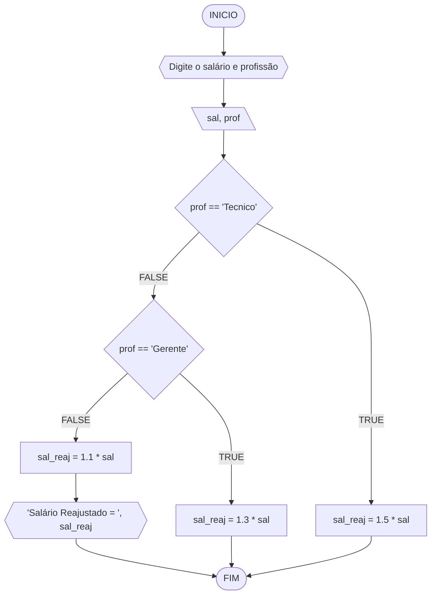

#### Pseudocódigo
```java
ALGORITMO calReajuste
DECLARE  sal, sal_reaj: real, prof: caractere

INICIO

    // Variaveis sal (Salário) e prof (Profissão) como entrada.
    LEIA sal, prof

    // Condições que decidirão para onde os dados de entrada serão enviados.
    ESCOLHA

        // Insira seu comentário
        CASO prof == “Técnico”		
            sal_reaj ← 1.5 * sal

        // Insira seu comentário
        CASO prof = “Gerente”		
            sal_reaj ← 1.3 * sal

    // Insira seu comentário
    SENÃO
        sal_reaj ← 1.1 * sal

    FIM_ESCOLHA

    // Insira seu comentário
    ESCREVA “Salário Reajustado = “, sal_reaj

FIM
```
