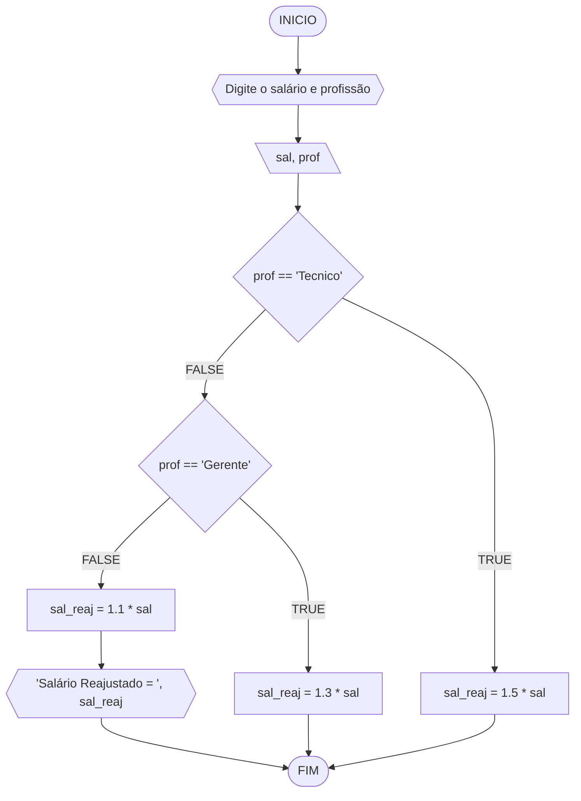
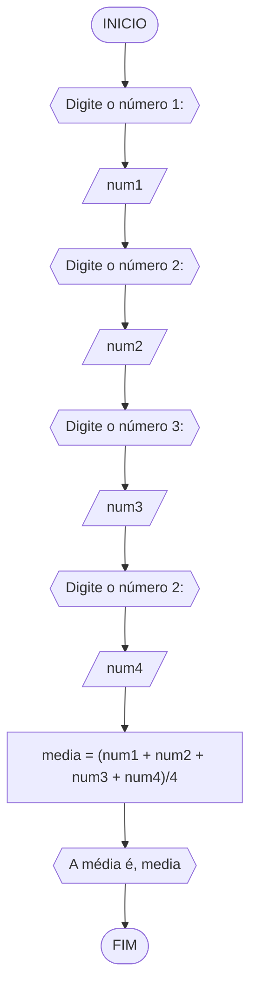
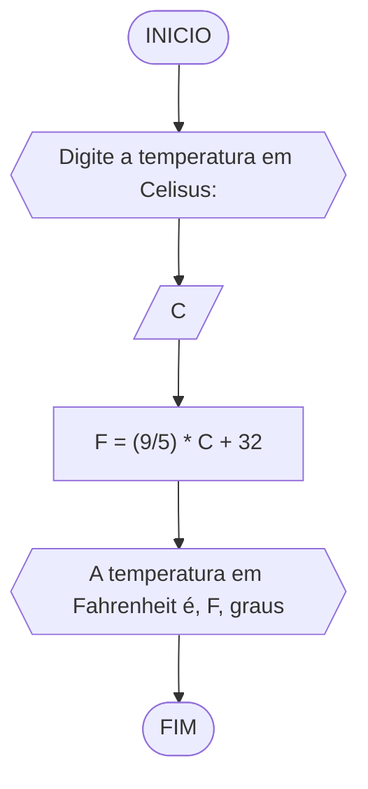
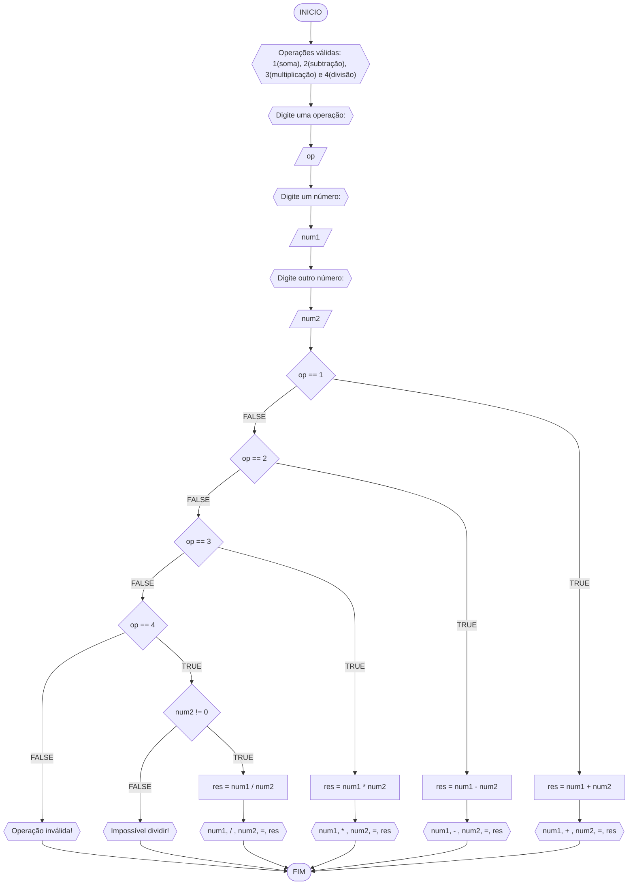
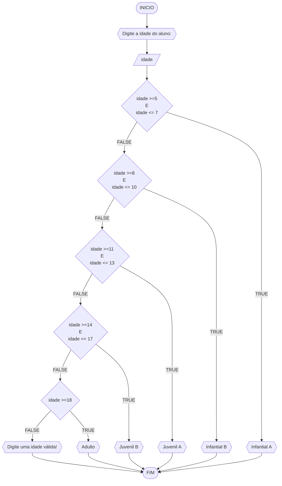

# UNIFOR
**Nome**: Pedro Henrique Xerez <br>
**Disciplina**: Raciocínio lógico algorítmico

## Exercício exemplo
Represente, em fluxograma e pseudocódigo, um algoritmo para calcular o adicional de salário de funcionário por cargo de uma empresa fictícia. Sabe-se que os funcionários de cargo técnico receberão reajuste de 50%, cargo de gerência, um reajuste de 30% e demais, um reajuste de 10%. 

#### Fluxograma


#### Pseudocódigo
```java
ALGORITMO calReajuste
DECLARE  sal, sal_reaj: real, prof: caractere

INICIO

    // Leitura das variaveis sal (Salário) e prof (Profissão) como entrada.
    LEIA sal, prof

    // Condições que decidirão para onde os dados de entrada serão enviados.
    ESCOLHA

        // Caso a profissão seja técnico, o salário é multiplicado em 1.5 (+50%) 
        CASO prof == “Técnico”		
            sal_reaj ← 1.5 * sal

        // Caso a profissão seja gerente, o salário é multiplicado por 1.3 (+30%)
        CASO prof = “Gerente”		
            sal_reaj ← 1.3 * sal

    // Caso a profissão não seja nenhuma das duas anteriores, o salário é multiplicado por 1.1 (+10%)
    SENÃO
        sal_reaj ← 1.1 * sal

    FIM_ALGORITMO

    // Texto para informar ao usuário seu novo salário ajustado.
    ESCREVA “Salário Reajustado = “, sal_reaj

FIM
```

#### Teste
| sal | prof | prof == “Técnico” | prof = “Gerente” | sal_reaj | Saída |
| -- | -- | -- | -- | -- | -- |
| 1000 | Técnico | V | F | 1500 | “Salário Reajustado = 1500“ |
| 2000 | Gerente | F | V | 2600 | “Salário Reajustado = 2600“ |
| 9000 | Diretor | F | F | 9900 | “Salário Reajustado = 9900“ |

## Lista de exercícios 02

### Exercício 01 (2.5 pontos)
Calcule a média de quatro números inteiros dados.

#### Fluxograma (1.0 ponto)



#### Pseudocódigo (1.0 ponto)

```java
ALGORTIMO Media
DECLARE num1, num2, num3, num4: REAL

INICIO

    // Solicitação para o usuário digitar o Dado 1 (1° Número)
    ESCREVA "Digite o número 1:"

    // Leitura do dado 1 (1° Número) 
    LEIA num1

    // Solicitação para o usuário digitar o Dado 2 (2° Número)
    ESCREVA "Digite o número 2:"

    // Leitura do dado 2 (2° Número)
    LEIA num2

    // Solicitação para o usuário digitar o Dado 3 (3° Numéro)
    ESCREVA "Digite o número 3:"

    // Leitura do dado 3 (3° Número)
    LEIA num3

    // Solicitação para o usuário digitar o Dado 4 (4° Número)
    ESCREVA "Digite o número 4:"

    // Leitura do Dado 4 (4° Número)
    LEIA num4

    // Calcular a média aritmética dos dados 1, 2, 3 e 4. Informar ao usuário qual é a média.
    media <- (num1 + num2 + num3 + num4)/4
    ESCREVA "A média é", media

FIM
```

#### Teste de mesa (0.5 ponto)

| num1 | num2 | num3 | num4 | saída | 
| --   | --   | --   | --   | --    | 
| 0.25 | 0.25 | 2.50 | 1.00 | 1.00  | 

### Exercício 02 (2.5 pontos)
Leia uma temperatura dada em Celsius (C) e imprima o equivalente em Fahrenheit (F). (Fórmula de conversão: F = (9/5) * C + 32)

#### Fluxograma (1.0 ponto)



#### Pseudocódigo (1.0 ponto)

```java
ALGORTIMO ConverteCelsiusFarenheit
DECLARE C, F: REAL

INICIO

    // Solicitação para que o usuário digita o dado 1
    ESCREVA "Digite a temperatura em Celsus:"

    // Leitura do Dado 1
    LEIA C

    // Aplicação da fórmula para alterar a temperatura de celcius para fahrenheit
    F <- (9/5) * C + 32

    // Apresentar ao usuário o valor de dado 1 informado em celsius como fahrenheit
    ESCREVA "A temperatura em Fahrenheit é", F, "graus"

FIM
```

#### Teste de mesa (0.5 ponto)

| C  | F  | saída                                  | 
| -- | -- | --                                     |
| 0  | 32 | A temperatura em Fahrenheit é 32 graus |

### Exercício 03 (2.5 pontos)
Receba dois números reais e um operador e efetue a operação correspondente com os valores recebidos (operandos). 
O algoritmo deve retornar o resultado da operação selecionada simulando todas as operações de uma calculadora simples.

#### Fluxograma (1.0 ponto)



#### Pseudocódigo (1.0 ponto)

```java
ALGORITMO CalculadoraSimples
DECLARE op: INTEIRO; num1,num2,res: REAL

INICIO

    // Solicitação para o usuário escrever as 4 operações da matemática
    ESCREVA "Operações válidas: 1(soma), 2(subtração), 3(multiplicação) e 4(divisão)"

    // Solicitação para o usuário escrever uma das operações
    ESCREVA "Digite uma operação:"

    // Leitura de dado da operação escolhida
    LEIA op

    // Solicitação para o usuário digitar um número, logo em seguida sua leitura é feita no algoritmo.
    ESCREVA "Digite um número:"
    LEIA num1

    // Solicitação para o usuário digitar outro número, logo em seguida sua leitura é feita no algoritmo.
    ESCREVA "Digite outro número:"
    LEIA num2

    // Condições a seguir para a escolha da operação
    ESCOLHA

        // Condição 1 para caso a operação escolhida tenha sido soma
        CASO op == 1

            // Somar 1° número com 2° número
            res = num1 + num2

            // Escrever expressão númerica, com base na operação escolhida (soma), e seu resultado.
            ESCREVA num1, "+", num2, "=", res

        // Condição para caso a operação escolhida tenha sido subtração
        CASO op == 2

            // Subtrair 1° número com 2° número
            res = num1 - num2

            // Escrever expressão númerica, com base na operação escolhida (subtração), e seu resultado.
            ESCREVA num1, "-", num2, "=", res

        // Condição para caso a operação escolhida tenha sido multiplicação
        CASO op == 3

            // Multiplicar 1° número com 2° número
            res = num1 * num2

            // Escrever expressão númerica, com base na operação escolhida (Multiplicação), e seu resultado.
            ESCREVA num1, "*", num2, "=", res

        // Condição para caso a operação escolhida tenha sido divisão
        CASO op == 4

            // Condição 2, se o segundo número for diferente de 0, continue o algoritmo
            SE num2 != 0 ENTAO

                // Dividir 1° número com 2° número
                res = num1 / num2

                // Escrever expressão númerica, com base na operação escolhida (Divisão), e seu resultado.
                ESCREVA num1, "/", num2, "=", res

            // Se a condição 2 não for atendida, escreva que é impossível dividir.
            SENAO
                ESCREVA "Impossível dividir!"

            FIM_ALGORITMO

    // Se nenhuma das condições validas forem escolhidas, informar que a operação é inválida.
    SENAO
        ESCREVA "Operação inválida!"

    FIM_ALGORITMO

FIM
```

#### Teste de mesa (0.5 ponto)

| num1 | num2 | op | num2 != 0 | res | saída               | 
| --   | --   | -- | --        | --  | --                  |
| 1    | 0    | 1  |           | 1   | 1 + 0 = 1           |
| 1    | 0    | 2  |           | 1   | 1 - 0 = 1           |
| 1    | 0    | 3  |           | 0   | 1 * 0 = 0           |
| 1    | 0    | 4  | False     |     | Impossível dividir! |
| 1    | 2    | 4  | True      | 0.5 | 1 / 2 = 0,5         |
| 1    | 2    | 5  |           |     | Operação inválida!  |

### Exercício 04 (2.5 pontos)
Elaborar um algoritmo que, dada a idade, classifique nas categorias: infantil A (5 - 7 anos), infantil B (8 -10 anos), juvenil A (11 - 13 anos), juvenil B (14 -17 anos) e adulto (maiores que 18 anos).

#### Fluxograma (1.0 ponto)



#### Pseudocódigo (1.0 ponto)

```
ALGORTIMO ClassificaCategoria
DECLARE idade: INTEIRO

INICIO

    // Solicitação para entrada de dado idade do aluno
    ESCREVA "Digite a idade do aluno:"

    // Leitura do dado informado
    LEIA idade

    // Condições a seguir para a classificação das idades
    ESCOLHA

        // Se a idade for entre 5 e 7.
        CASO idade >=5 E idade <= 7

            // Informar ao usuário que a idade do dado informado pertence ao infantil A
            ESCREVA "Infantial A"

        // Se a idade for entre 8 e 10
        CASO idade >=8 E idade <= 10

            // Informar ao usuário que a idade do dado informado pertence ao infantil B
            ESCREVA "Infantial B"

        // Se a idade for entre 11 e 13
        CASO idade >=11 E idade <= 13

            // Informar ao usuário que a idade do dado informado pertence ao Juvenil A
            ESCREVA "Juvenil A"

        // Se a idade for entre 11 e 13
        CASO idade >=14 E idade <= 17

            // Informar ao usuário que a idade do dado informado pertence ao Juvenil B
            ESCREVA "Juvenil B"

        // Se a idade for maior ou igual a 18
        CASO idade >=18

            // Informar ao usuário que a idade do dado informado pertence à classificação "adulto".
            ESCREVA "Adulto"

    // Caso nenhuma das condições sejam atendidas
    SENAO

        // Informe ao usuário para que ele digite uma idade válida.
        ESCREVA "Digite uma idade válida!"

    FIM_ESCOLHA

FIM
```

#### Teste de mesa (0.5 ponto)

| idade | idade >=8 E idade <= 10 | idade >=11 E idade <= 13 | idade >=14 E idade <= 17 | idade >=18 | saída                       | 
| --    | --                      | --                       | --                       | --         | --                          |
| 4     | False                   | False                    | False                    | False      | Digite uma idade válida!    |
| -4    | False                   | False                    | False                    | False      | Digite uma idade válida!    |
| 8     | True                    | False                    | False                    | False      | Infantial A                 |
| 11    | False                   | True                     | False                    | False      | Infantial B                 |
| 17    | False                   | False                    | True                     | False      | Infantial C                 |
| 21    | False                   | False                    | False                    | True       | Adulto                      |
