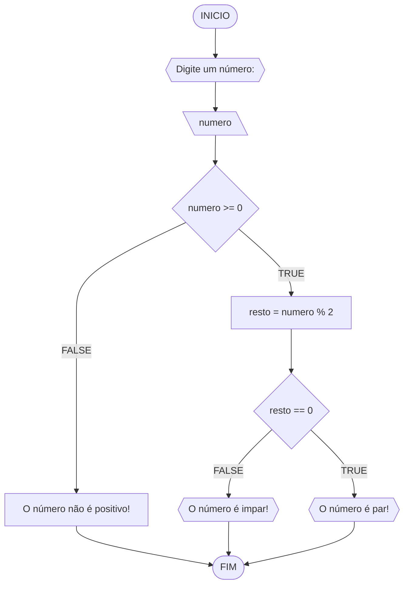
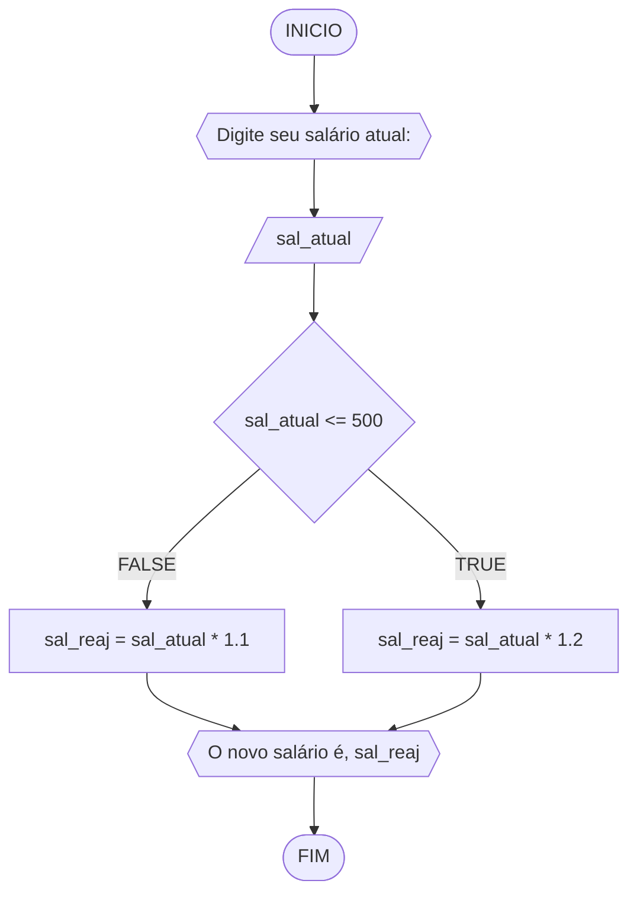
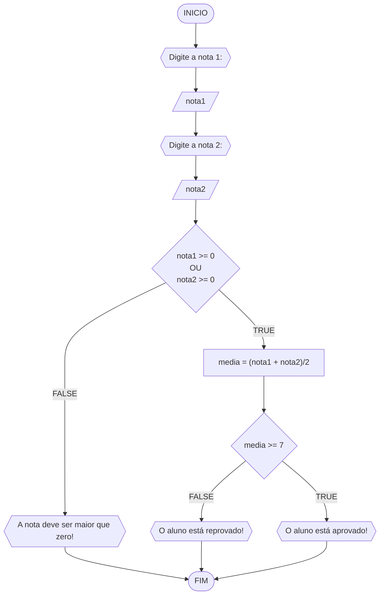
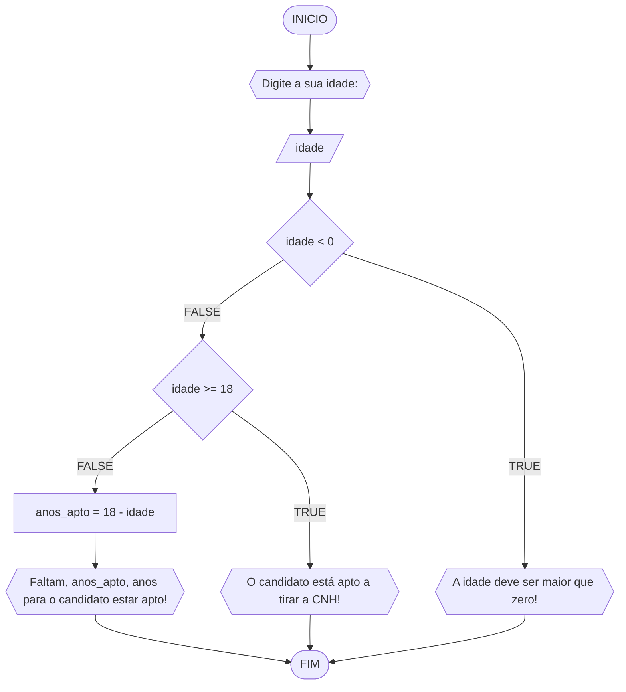

# UNIFOR
**Nome**: Pedro Henrique Xerez C B Ramos <br>
**Disciplina**: Raciocínio lógico algorítmico

## Lista de exercícios 01

### Exercício 01 (1 ponto)
Represente, em fluxograma e pseudocódigo, um algoritmo para determinar se um número inteiro e positivo é par ou impar.

#### Fluxograma (0,25 ponto)



#### Pseudocódigo
```java
ALGORTIMO verifica_par_impar
DECLARE numero, resto: INTEIRO

INICIO

    // Dado de entrada.
    ESCREVA "Digite um número: "
    
    // Leitura do dado.
    LEIA numero
    
    // Condição 1, se o número for positivo, continue o código..
    SE numero >= 0 ENTAO

        // Cálculo para saber o resto dentro da Condição 1.
        resto <- numero % 2

        // Se o cálculo de resto for igual a 0, número par.
        SE resto == 0 ENTAO
            ESCREVA "O número é par!"

        // Se o cálculo de resto não for igual a 0, número impar.
        SENAO
          ESCREVA "O número é impar!"

        FIM_SE

    // Se a condição 1 não for atendida, informar que o número deve ser positivo.
    SENAO             
        ESCREVA "O número deve ser postivo!"

    FIM_ALGORITMO

FIM
```

#### Tabela de testes (0,25 ponto)
| numero | numero >= 0 | resto | resto == 0 | Saída |
| -- | -- | -- | -- | -- | 
| -1 | F |   |   | "O número deve ser postivo!" |
| 0  | V | 0 | V | "O número é par!" |
| 13 | V | 1 | F | "O número é impar!" |
| 30 | V | 0 | V | "O número é par!" |

## Exercício 02 (3 pontos)
Represente, em fluxograma e pseudocódigo, um algoritmo para calcular o novo salário de um funcionário. 
Sabe-se que os funcionários que recebem atualmente salário de até R$ 500 terão aumento de 20%; os demais terão aumento de 10%.

#### Fluxograma (1.0 ponto)



#### Pseudocódigo (1.0 ponto)

```java
ALGORTIMO ReajusteSalario
DECLARE sal_atual, sal_reaj: REAL

INICIO

    // Solicitar que o usuário digite o dado salário atual.
    ESCREVA "Digite seu salário atual:"

    // Leitura do dado feita pelo algoritmo.
    LEIA sal_atual

    // Condição 1: salário ser menor ou igual à 500. Se for atendida, multiplicar o dado por 1.2 (aumento de 20%).
    SE sal_atual <= 500 ENTAO
        sal_reaj = sal_atual * 1.2

    // Se a condição 1 não for atendida, multiplicar dado salário atual por 1.1 (aumento de 10%).
    SENAO
        sal_reaj = sal_atual * 1.1

    FIM_ALGORITMO

    // Enviar mensagem para o usuário informando seu novo salário conforme foi modificado no código.
    ESCREVA "O novo salário é R$", sal_reaj

FIM
```

#### Tabela de testes (1.0 ponto)

| sal_atual | sal_atual >= 500 |sal_reaj       | saída                   | 
| --        | --               | --            | --                      | 
| 400       | False            | 400*1.2 = 480 | O novo salário é R$ 480 |
| 500       | True             | 500*1.2 = 600 | O novo salário é R$ 600 |
| 600       | True             | 600*1.1 = 660 | O novo salário é R$ 660 |

## Exercício 03 (3 pontos)
Represente, em fluxograma e pseudocódigo, um algoritmo para calcular a média aritmética entre duas notas de um aluno e mostrar sua situação, que pode ser aprovado ou reprovado.

#### Fluxograma (1 ponto)



#### Pseudocódigo (1 ponto)

```java
ALGORTIMO SituacaoAluno
DECLARE nota1, nota2, media: REAL

INICIO

    // Solicitação para o usuário digitar a nota 1
    ESCREVA "Digite a nota 1:"

    // Leitura do dado 1 (nota 1)
    LEIA nota1

    // Solicitação para o usuário digitar a nota 2
    ESCREVA "Digite a nota 2:"

    // Leitura do dado 2 (nota 2)
    LEIA nota2

    // Condição 1, Se nota 1 e nota 2 forem maiores ou iguais a 0, continuar algoritmo
    SE nota1 >= 0 E nota2 >= 0 ENTAO

        // Calcular média aritmética de nota 1 e nota 2
        media =  (nota1 + nota2)/2

        // Condição 1.1. Se a média for maior ou igual à 7, informar ao usuário uma mensagem que o aluno está aprovado.
        SE media >= 7 ENTAO
            ESCREVA "O aluno está aprovado!"

        // Se condição 1.1 não for atendida, informar que o aluno está reprovado.
        SENAO
            "O aluno está reprovado!"

        FIM_ALGORITMO

    // Se condição 1 não for atendida, informar que a nota deve ser maior que zero.
    SENAO
        ESCREVA "A nota deve ser maior que zero!"

    FIM_ALGORITMO

FIM
```

#### Tabela de testes (1 ponto)

| nota1 | nota2 | nota1 >= 0 E nota2 >= 0 | media        | saĩda | 
| --    | --    | --                      | --           | --    | 
| -1    | 0     | False                   |              | A nota deve ser maior que zero! | 
| 0     | 0     | True                    | (0+0)/2 = 0  | O aluno está reprovado!|
| 4     | 8     | True                    | (4+8)/2 = 6  | O aluno está reprovado!|
| 4     | 10    | True                    | (4+10)/2 = 7 | O aluno está aprovado!|

## Exercício 04 (3 pontos)
Represente, em fluxograma e pseudocódigo, um algoritmo que, a partir da idade do candidato(a), determinar se pode ou não tirar a CNH. 
Caso não atender a restrição de idade, calcular quantos anos faltam para o candidato estar apto.

#### Fluxograma (1.0 ponto)



#### Pseudocódigo (1.0 ponto)

```java
ALGORTIMO AptoCNH
DECLARE idade, anos_apto: INTEIRO

INICIO

    // Solicitação para que o usuário digite o dado 1 (Sua idade)
    ESCREVA ""Digite a sua idade:"

    // Leitura do dado 1
    LEIA idade

    // Condição 1, caso o dado 1 seja menor que zero, informar que a idade deve ser maior que zero.
    SE idade < 0 ENTAO
        ESCREVA "A idade deve ser maior que zero!"

    // Caso a condição um não seja atendida, continuar algoritmo.
    SENAO

        // Condição 2. Se a idade do candidato for maior ou igual a 18, informar que está apto para tirar a CNH.
        SE idade >= 18 ENTAO
            ESCREVA "O candidato está apto a tirar a CNH!"

        // Caso a condição 2 não seja atendida, continuar o algoritmo.
        SENAO

            // Calcular 18 - Dado 1.
            anos_apto <- 18 - idade

            // Informar que faltam x (Resultado entre 18 - Dado 1) ano (s) para o candidato estar apto.
            ESCREVA "Faltam", anos_apto, "ano(s) para o candidato estar apto!"

        FIM_ALGORITMO

    FIM_ALGORITMO

FIM
```

#### Tabela de testes (1.0 ponto)

| idade | idade < 0 | idade >= 18 | anos_apto | saída                                         | 
| --    | --        | --          | --        | --                                            | 
| -1    | True      |             |           |                                               |
| 0     | False     | False       | 18-0 = 18 | Faltam 18 ano(s) para o candidato estar apto! |
| 17    | False     | False       | 18-17 = 1 | Faltam 1 ano(s) para o candidato estar apto!  |
| 18    | False     | True        |           | O candidato está apto a tirar a CNH!          |
