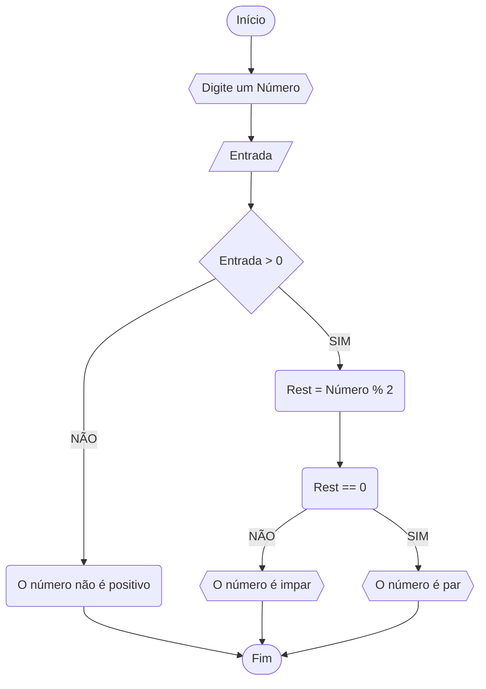

# Unifor

**Nome do Aluno**: Pedro Henrique
**Disciplina**: RLA
## Exercício 3
### Fluxograma

```mermaid
flowchart TD
A([Início]) --> B{{Digite um Número}} --> C[/Entrada/]
C --> D{Entrada > 0}
D --NÃO--> E(O número não é positivo)
D --SIM--> F(Rest = Número % 2)
E --> Z([Fim])
F --> G(Rest == 0)
G --NÃO--> H{{O número é impar}}
G --SIM--> I{{O número é par}}
H --> Z
I --> Z
```
